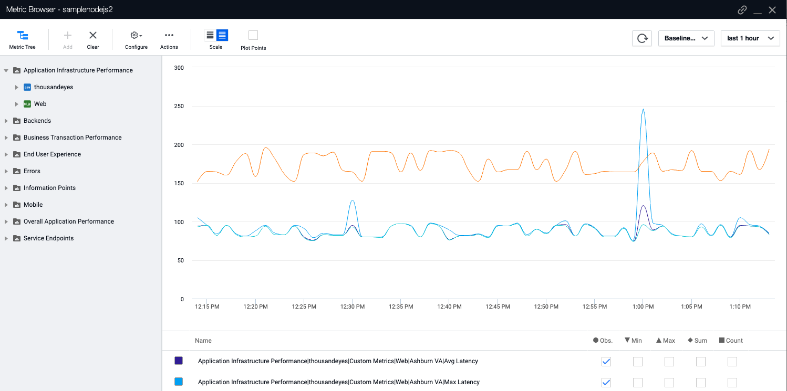

# ThousandEyes Machine Agent Extension 

This code provides an example of how to create an AppDynamics machine agent custom monitor extension for ThousandEyes. This extension streams monitoring data from ThousandEyes to AppDynamics. The custom monitor runs a Python script that periodically pulls test data from the ThousandEyes API, transforms the data payload, and pushes data into AppDynamics via **custom metrics** and/or the **analytics platform** (via the AppDynamics Analytics Events API).



## Prerequisites
Before the extension can be used, the following prequisites must be in place:

* This extension collects data from the ThousandEyes REST API. Make sure that the API is available and accessible. To access the ThousandEyes REST API, you need a valid ThousandEyes user account with API permissions and an API token. See https://developer.thousandeyes.com/ for more information on accessing the ThousandEyes API.

* This extension uses a standalone machine agent. For more details on downloading these products, visit https://docs.appdynamics.com/display/PRO45/Extensions+and+Custom+Metrics. The extension needs to be able to connect to ThousandEyes and AppDynamics in order to collect and send metrics. 
 
The ThousandEyes monitor machine agent does not need to run in the same environemnt as your application. When using custom metrics, you can only associate a machine agent (the ThousandEyes monitor) with one application. Therefore, if you want to associate metrics with an application you're monitoring, you must deploy one ThousandEyes machine agent extension for each application. Alternatively, using a "dummy app" allows monitoring multiple applications with one machine agent.  

Analytics can monitor multiple applications with a single machine agent.

## Setup and Usage

### Get the Code

If you're installing on an existing machine agent, you can clone the GitHub repo or pull the zip archive using `wget`. Make sure that `MACHINE_AGENT_HOME` is set.

```bash
apt-get update
apt-get install wget
wget https://github.com/thousandeyes/appd-integration-reference/archive/master.tar.gz && \
    tar -xzvf master.tar.gz && \
    sudo mkdir -p ${MACHINE_AGENT_HOME}/monitors && \
    sudo mv appd-integration-reference-master/custom-monitor/thousandeyes ${MACHINE_AGENT_HOME}/monitors && \
    rm -rf appd-integration-reference-master && rm master.tar.gz
```

### Install

Run `install.sh` in the **thousandeyes** folder to configure Python and some other dependencies.

```bash
./${MACHINE_AGENT_HOME}/monitors/thousandeyes/install.sh
```

### Configure

You'll need to configure your connection info, metrics format, and what ThousandEyes tests you want to pull data from. You can edit the **config.json** file or use environment variables. Environment variables take precedence over the **config.json** file (making **config.json** optional).

**env variables**
```bash
TE_METRIC_TEMPLATE
TE_SCHEMA_NAME
APPD_GLOBAL_ACCOUNT
APPD_API_KEY
TE_EMAIL
TE_API_KEY
TE_ACCOUNTGROUP
TE_TESTS 
```

**config.json**
```json
{
    "account-id":"", 
    "api-key":"",
    "te-email":"",
    "te-api-key":"",
    "te-accountgroup":"",
    "te-tests":[""],
    "metric-template":"",
    "schema-name":""
}
```

#### Metric Name Template - `TE_METRIC_TEMPLATE`/`metric-template`

One of the most important configuration options (when using custom metrics) is the custom metric name template. `TE_METRIC_TEMPLATE`/`metric-template` specifies the format of the custom metric. The default and recommended format is:

`name=Custom Metrics|thousandeyes|{tier}|{testName}|{agent}|{metricname},value={metricvalue}`

The `{bracketed}` entries in the custom metrics template refer to variables that you can use that will be substituted at runtime. These variables are extracted in the (Python) monitor script:

The **metric template** also supports `{metricname}` and `{metricvalue}`, which are set to the name and value of each metric.

*  `{metricname}` and `{metricvalue}` - Set to the name and value of each metric. The mapping between ThousandEyes metric name and AppDynamics metric name is defined in **metrics.json** (see below).
* `{testName}` - The name of the ThousandEyes test associated with the metric.
* `{app}`, `{tier}`, `{node}` - These variables are set to metadata values you can specify in the **Description** field of the ThousandEyes tests. The metadata format is: 

```json
{ 
    "appd_application":"myapp", 
    "appd_tier":"myapptier", 
    "appd_node":"mynode"
}
```

where `appd_application` sets `{app}`, `appd_tier` sets `{tier}`, and `appd_node` sets `{node}`. 

**metrics.json**
The **metrics.json** defines the list of ThousandEyes metrics to monitor and their name as they will appear in AppDynamics. This file does not need to be changed unless you want to add or remove ThousandEyes metrics. The default metrics are:

```json
{ 
    "pageLoadTime": "Page Load",
    "domLoadTime": "DOM Load",
    "dnsTime": "DNS Time",
    "responseTime": "Response Time",
    "connectTime": "Connect Time",
    "waitTime": "Wait Time",
    "receiveTime": "Receive Time",
    "totalTime": "Total Time",
    "totalSize": "Total Size", 
    "responseCode": "Response Code",
    "numRedirects": "Redirectes",
    "wireSize": "Wire Size",
    "avgLatency": "Avg Latency",
    "maxLatency": "Max Latency",
    "minLatency": "Min Latency",
    "loss": "Loss",
    "jitter": "Jitter"
} 
```

**NOTE** - The ThousandEyes monitor currently supports pulling metrics from the following ThousandEyes test types:

* Page Load
* HTTP/Web
* Network

The various metrics values that are available can be found [here](https://developer.thousandeyes.com/v6/tests/#/test_metadata). 

The **monitor.py** file can be enhanced to pull additional metrics from ThousandEyes using additional API endpoints. For example, path trace metrics can be pulled from the `/net/path-viz` endpoint. Additional information can be found at 
[developer.thousandeyes.com](https://developer.thousandeyes.com/).

#### Other Configuration Settings

* `APPD_GLOBAL_ACCOUNT`/`account-id` is your full Global Account Name, located in AppDynamics under **License > Account**. (Analytics only)
* `APPD_API_KEY`/`api-key` is your account Access Key under **License > Account** (or **Rules** if you have those set up). (Analytics only)
* `TE_EMAIL`/`te-email` is your ThousandEyes email address.
* `TE_API_KEY`/`te-api-key` is your ThousandEyes API key.
* `TE_ACCOUNTGROUP`/`te-account group` is the ThousandEyes account group name.
* `TE_TESTS`/`te-tests` is an array of tests to pull data from. Multiple tests are supported. Note, this is a JSON array, such as `["test1","test2"]`. When it is set as an environment variable, you must include outer single quotation marks: `'["test1","test2"]'`. 

```bash
TE_TESTS='["mytest1", "mytest2"]'
```

When passing as an environment variable to `docker-compose`, you must omit the outer ' ' (due to YAML parsing). This can feel odd as it's not valid bash syntax.

```bash
TE_TESTS=["mytest1", "mytest2"]
```

`TE_SCHEMA_NAME`/`schema-name` is the name of the schema that will be used for Analytics. This is optional and defaults to `thousandeyes`. If you change the **schema.json** file, you must change the name of the schema to a new and unique schema name.

### Associating Your Machine Agent with an Application

To associate the ThousandEyes monitor machine agent with an application in AppDynamics, you must set the following environment variables:

```bash
APPDYNAMICS_AGENT_APPLICATION_NAME=yourapp
APPDYNAMICS_AGENT_TIER_NAME=thousandeyes
APPDYNAMICS_AGENT_NODE_NAME=thousandeyes
```

Set `APPDYNAMICS_AGENT_APPLICATION_NAME` to the name of an application in AppDynamics. 

Set `APPDYNAMICS_AGENT_TIER_NAME` and `APPDYNAMICS_AGENT_NODE_NAME` to `thousandeyes`. This is the default recommended, but can be changed if desired. The ThousandEyes monitor will appear under the specified application as a `thousandeyes` Java tier.

Note that custom metrics only allow associating a machine agent with a _single application_ in AppDynamics. When you write metrics to an app you're monitoring in AppDynamics, we recommend using the following metrics template:

* `name=Custom Metrics|thousandeyes|{tier}|{testName}|{agent}|{metricname},value={metricvalue}`

These will appear under the application's metrics, under each tier that we're generating metrics for.

In some cases, you may want to use a single machine agent monitor to stream data for _multiple applications_. In this scenario, you can consider creating a "dummy application" in Appdynamics and associating the machine agent with that application. This will not be the same app as the apps you're monitoring. Using a dummy application will allow collecting metrics for multiple applications using a single ThousandEyes monitor machine agent. In this case, you will most likely want to use the following metric template (note the added `{app}`):

* `name=Custom Metrics|thousandeyes|{app}|{tier}|{testName}|{agent}|{metricname},value={metricvalue}`

Note the addition of the `{app}` variable, allowing multiple applications (as specified in the ThousandEyes test metadata) to report data under the same machine agent/dummy app.

### Monitor Config XML

The **monitor.xml** does not need to be modified. The only reason to modify it would be to change the execution to `continuous` mode. This requires updating the Python code to run continuously and should use the `metric-period`/`TE_METRIC_PERIOD` configuration value.

### Additional Machine Agent Settings

The following machine agent environment settings may also need to be configured. However, if running on an existing machine agent, these should already be set:

* APPDYNAMICS_AGENT_ACCOUNT_NAME
* APPDYNAMICS_AGENT_ACCOUNT_ACCESS_KEY
* APPDYNAMICS_CONTROLLER_HOST_NAME
* APPDYNAMICS_CONTROLLER_PORT
* APPDYNAMICS_CONTROLLER_SSL_ENABLED

**NOTE** - See [/appd-integration-reference/custom-monitor-docker] for deploying the ThousandEyes monitor machine agent as a pre-built Docker container.

### Check That the ThousandEyes Monitor Is Running

```
tail -n 50 /opt/appdynamics/machine-agent/logs/machine-agent.log
```

You should see logs of the monitor being run periodically:

```
[Agent-Monitor-Scheduler-4] 20 Aug 2020 05:01:35,386  INFO PeriodicTaskRunner - Periodic Task - setup metric feed for [ThousandEyesMonitor]
[Agent-Monitor-Scheduler-4] 20 Aug 2020 05:01:35,386  INFO PeriodicTaskRunner - Returning time out value of [120000] ms for monitor task [ThousandEyesMonitor]
[Agent-Monitor-Scheduler-4] 20 Aug 2020 05:01:35,387  INFO ExecTask - Running Executable Command [[/opt/appdynamics/machine-agent/monitors/thousandeyes/monitor.sh]]
[Agent-Monitor-Scheduler-4] 20 Aug 2020 05:01:41,639  INFO MonitorStreamConsumer - Stopping monitored process
```

### docker-compose and Quoted Environment Variables

When the following bash-conforming environment variable file

```bash
TE_ACCOUNTGROUP="Integration AppD"
TE_TESTS='["samplenodejs2"]'
TE_SCHEMA_NAME=thousandeyes
```

is passed as an environment to `docker-compose`, it is parsed by `yaml` which, unlike `bash`, aims to preserve all quotation marks, including outer quotation marks. The resulting environment variables (in the Docker container) are thus rendered with unexpected extra quotation marks:

```bash
TE_ACCOUNTGROUP='"Integration AppD"'
TE_TESTS='["samplenodejs2"]'
TE_SCHEMA_NAME=thousandeyes
```
